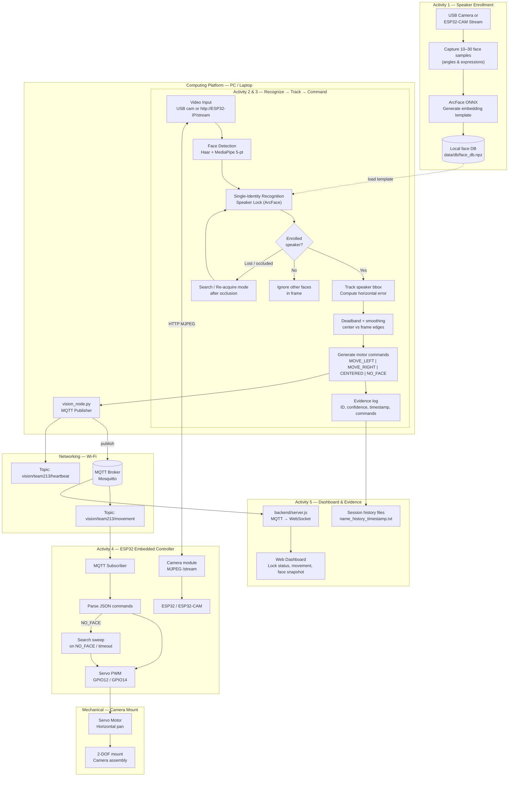
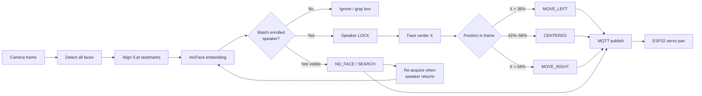
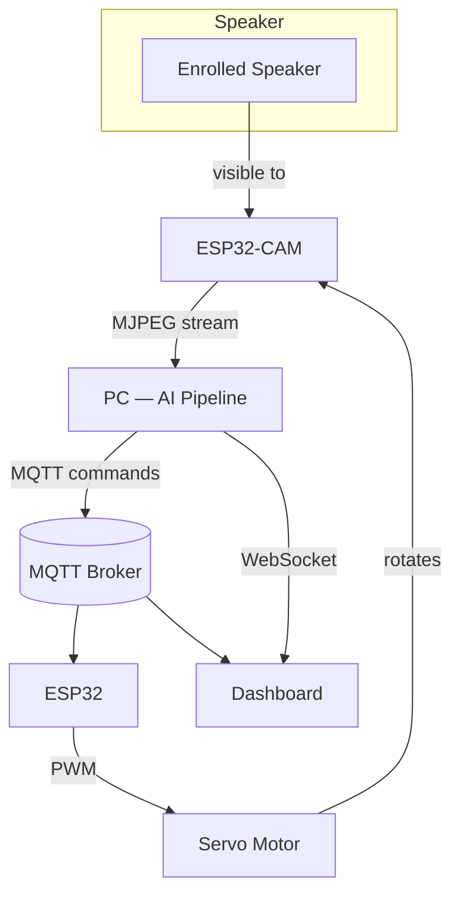

# Face Recognition with ArcFace ONNX and 5-Point Alignment

**Instructor:** Gabriel Baziramwabo  
**Organization:** Rwanda Coding Academy  

This project implements a **Distributed Face Recognition and Tracking System** for IoT-based servo control using:

- **ArcFace** model (ONNX) for face recognition
- **5-point facial landmark alignment** for precise face detection
- **MQTT** for distributed communication between components
- **ESP32** microcontroller (camera stream + servo motor control)
- **Real-time Web Dashboard** for system monitoring

## System Architecture

1. **Vision Node (PC)**: Reads video from ESP32 camera stream (or USB webcam), detects/recognizes the enrolled speaker, publishes movement commands via MQTT.
2. **MQTT Broker (VPS)**: Central message broker.
3. **ESP32 (Edge)**: Hosts the camera, subscribes to MQTT commands, drives the servo under the camera mount.
4. **Web Dashboard**: Real-time status via WebSocket.

### Architecture diagram



### Recognize → Track → Command pipeline



### Component overview



## Project Structure

```
FaceLockingServo/
├── src/
│   ├── vision_node.py       # Main vision + MQTT publisher
│   ├── face_locking.py      # Speaker lock & action detection
│   ├── enroll.py            # Face enrollment
│   ├── camera.py            # USB or ESP32 stream helper
│   └── session_log.py       # CSV evidence logger
├── esp32/
│   ├── camera_servo/        # ESP32-CAM: stream + servo (recommended)
│   ├── vision_servo/        # ESP32 Dev: servo only (MQTT)
│   └── servo_test/          # Standalone servo sweep test
├── backend/
├── dashboard/
└── data/
    ├── db/                  # face_db.npz
    └── logs/                # session_*.csv evidence logs
```

## Network settings

Wi-Fi and IP addresses are defined in **`src/network_config.py`** and must match **`esp32/*.ino`** sketches.

| Setting | Current value |
|---------|----------------|
| Wi-Fi SSID | `Tecno pop` |
| Wi-Fi password | `tecnopop` |
| PC IP (example) | `192.168.1.100` |
| ESP32 IP (static) | `192.168.1.50` |
| ESP32 stream | `http://192.168.1.50/stream` |
| MQTT broker | `157.173.101.159` |

Connect **both PC and ESP32** to the same Wi-Fi. After flashing, confirm in Serial Monitor (115200):

```
WiFi OK  IP: 192.168.1.50
Stream: http://192.168.1.50/stream
MQTT connected
```

## Quick Start

### 1. Install dependencies

```bash
pip install -r requirements.txt
cd backend && npm install
```

### 2. Flash ESP32

| Board | Sketch | Servo pin |
|-------|--------|-----------|
| ESP32-CAM (camera + servo) | `esp32/camera_servo/camera_servo.ino` | GPIO **12** |
| ESP32 Dev Module (servo only) | `esp32/vision_servo/vision_servo.ino` | GPIO **5** |
| Servo test only | `esp32/servo_test/servo_test.ino` | GPIO **12** |

Arduino IDE: **AI Thinker ESP32-CAM**, PSRAM **Enabled**. See `esp32/README.md` for wiring.

Update `ssid` / `password` in the sketch if your Wi-Fi changes, then re-flash.

### 3. List USB cameras (optional)

```bash
python src/vision_node.py --list-cameras
```

Typical on this setup: index `0` = laptop webcam, index `1` = external USB robot camera.

### 4. Enroll speaker

**USB robot camera:**

```bash
python -m src.enroll --camera 1
```

**ESP32-CAM stream:**

```bash
python -m src.enroll --camera http://192.168.1.50/stream
```

Enter name (e.g. `Patience`), capture 10–15+ samples, press **s** to save.

### 5. Start the system

**Terminal 1 — Backend + dashboard:**

```bash
cd backend
npm start
```

**Terminal 2 — Vision node (USB robot camera, default):**

```bash
python src/vision_node.py --broker 157.173.101.159 --name Patience --camera 1
```

**Or ESP32-CAM stream:**

```bash
python src/vision_node.py --broker 157.173.101.159 --name Patience --camera http://192.168.1.50/stream
```

**Auto-find ESP32 on the LAN** (if IP is unknown):

```bash
python src/vision_node.py --broker 157.173.101.159 --name Patience --camera http://192.168.1.50/stream --discover
```

Press **q** in the vision window to quit.

### 6. Dashboard

- On this PC: http://localhost:8080
- From another device on **Tecno pop**: http://192.168.1.100:8080

## Camera options

| Source | `--camera` value |
|--------|------------------|
| Laptop built-in webcam | `0` |
| External USB robot camera (default) | `1` |
| ESP32-CAM MJPEG stream | `http://192.168.1.50/stream` |
| ESP32 mDNS (after flash) | `http://esp32cam.local/stream` |

**Test camera:**

```bash
python -m src.camera --camera 1
python -m src.camera --camera http://192.168.1.50/stream --discover
```

## MQTT Topics

- `vision/team213/movement` — small JSON commands for ESP32:
  - `status` — `MOVE_LEFT`, `MOVE_RIGHT`, `CENTERED`, `NO_FACE`
  - `spec_status` — `MOVED_LEFT`, `MOVED_RIGHT`, `CENTERED`, `OUT_OF_FRAME`
  - `confidence`, `target`, `locked`, `timestamp`
- `vision/team213/snapshot` — face image for dashboard (kept separate so ESP32 messages stay small)
- `vision/team213/heartbeat` — system health

## Evidence logging

| Log | Location | Contents |
|-----|----------|----------|
| Session CSV | `data/logs/session_<name>_<timestamp>.csv` | timestamp, speaker_id, confidence, motor_status, spec_status, locked |
| Action history | `<name>_history_<timestamp>.txt` | lock acquire/lost, blinks, landmark actions |

Session logs are created automatically when you run `vision_node.py`.

## Face Locking

1. **Search** — ArcFace finds the enrolled speaker.
2. **Lock** — Tracks only that identity; other faces are ignored.
3. **Re-acquire** — Returns to search if the speaker is lost briefly.

Speaker names are matched **case-insensitively** (`patience` → `Patience`).

## Hardware and safety

### Wiring (ESP32-CAM + servo)

| Component | Connection |
|-----------|------------|
| Servo signal | GPIO **12** (ESP32-CAM) or GPIO **5** (ESP32 Dev Module / `vision_servo.ino`) |
| Servo VCC | **5V** external supply (recommended — do not power a standard servo from 3.3V) |
| Servo GND | Common ground with ESP32 |
| Camera | On-board OV2640 (ESP32-CAM) or USB webcam on PC |

### Safety

- Use a **stable wide base** so the mount does not tip when the servo moves.
- Keep cables clear of the servo sweep path.
- Limit sweep to 0°–180° (enforced in firmware).
- Disconnect power before changing wiring.
- Shared MQTT broker: use a unique `TEAM_ID` if multiple teams publish to the same VPS.

## Validation demo (for assessors)

Run these scenarios and keep the session CSV + screenshots:

1. **Enrollment** — Enroll one speaker (10–15+ samples), save with **s**.
2. **Single-speaker lock** — Start tracking; confirm only the enrolled speaker gets a green box.
3. **Multiple faces** — A second person enters frame; confirm they are ignored (gray/gold box only).
4. **Tracking** — Speaker moves left/right; confirm `MOVED_LEFT` / `MOVED_RIGHT` / `CENTERED` in `data/logs/session_*.csv`.
5. **Occlusion** — Cover the speaker briefly; confirm `OUT_OF_FRAME` / `NO_FACE`, then re-acquire (`LOCK_ACQUIRED` in history file).
6. **Servo** — Confirm ESP32 pans to keep the speaker near frame center.

```bash
# Full demo run (USB robot camera)
python -m src.enroll --camera 1
cd backend && npm start
python src/vision_node.py --broker 157.173.101.159 --name Patience --camera 1

# Full demo run (ESP32-CAM stream)
python -m src.enroll --camera http://192.168.1.50/stream
python src/vision_node.py --broker 157.173.101.159 --name Patience --camera http://192.168.1.50/stream
```
